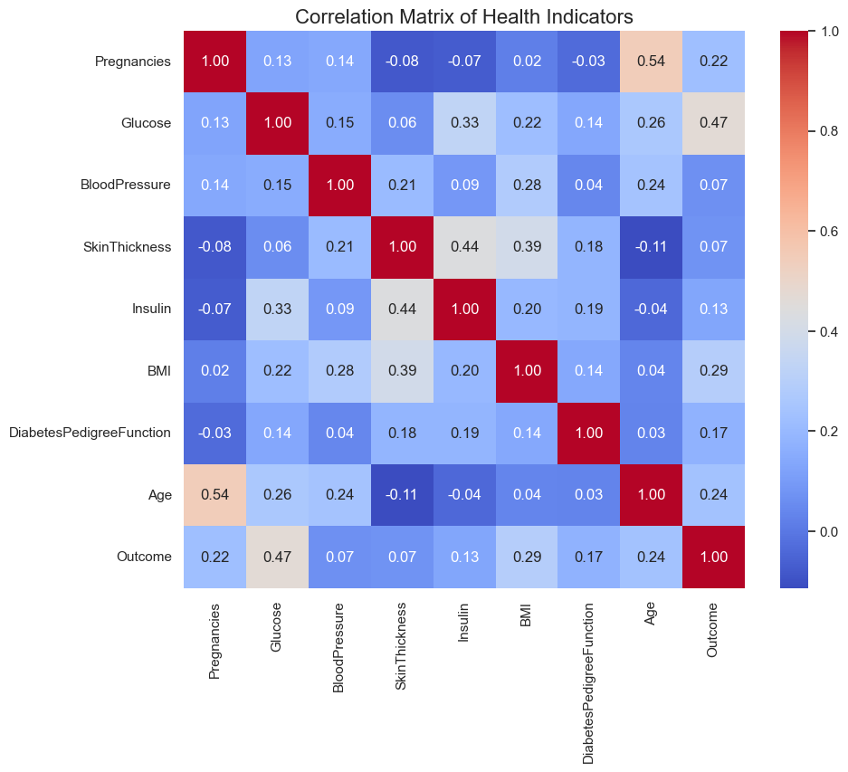
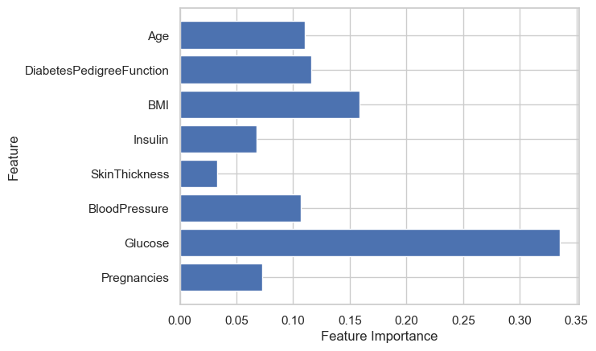
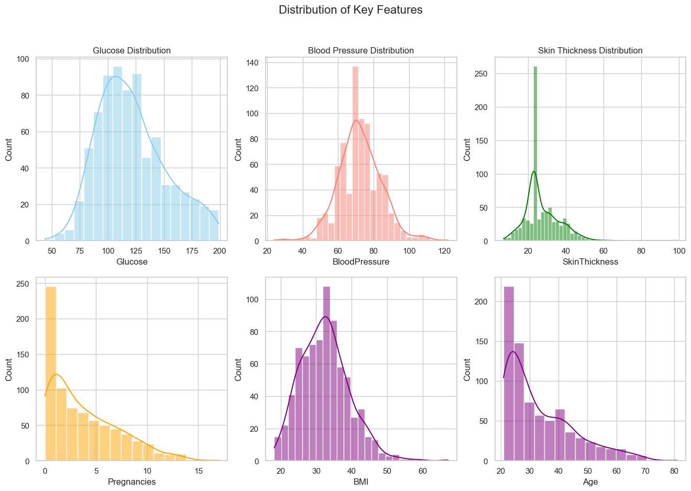
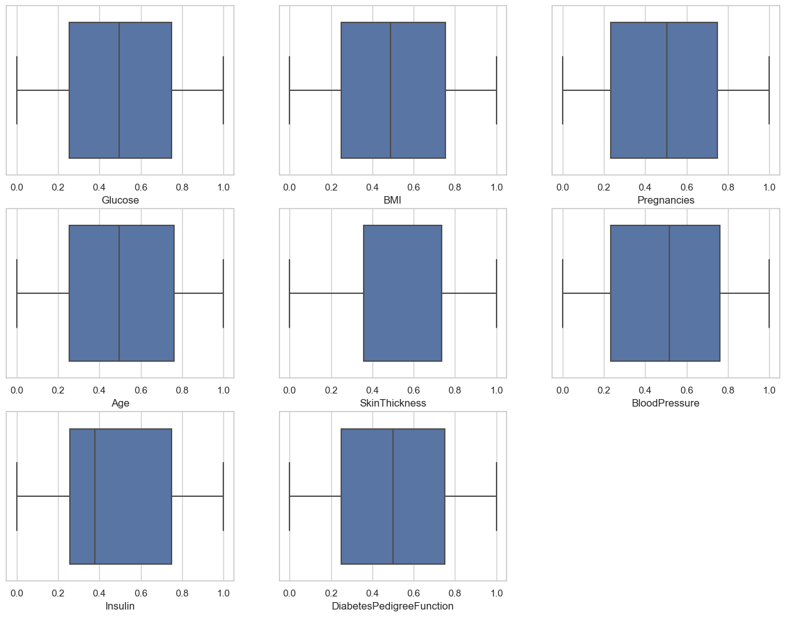
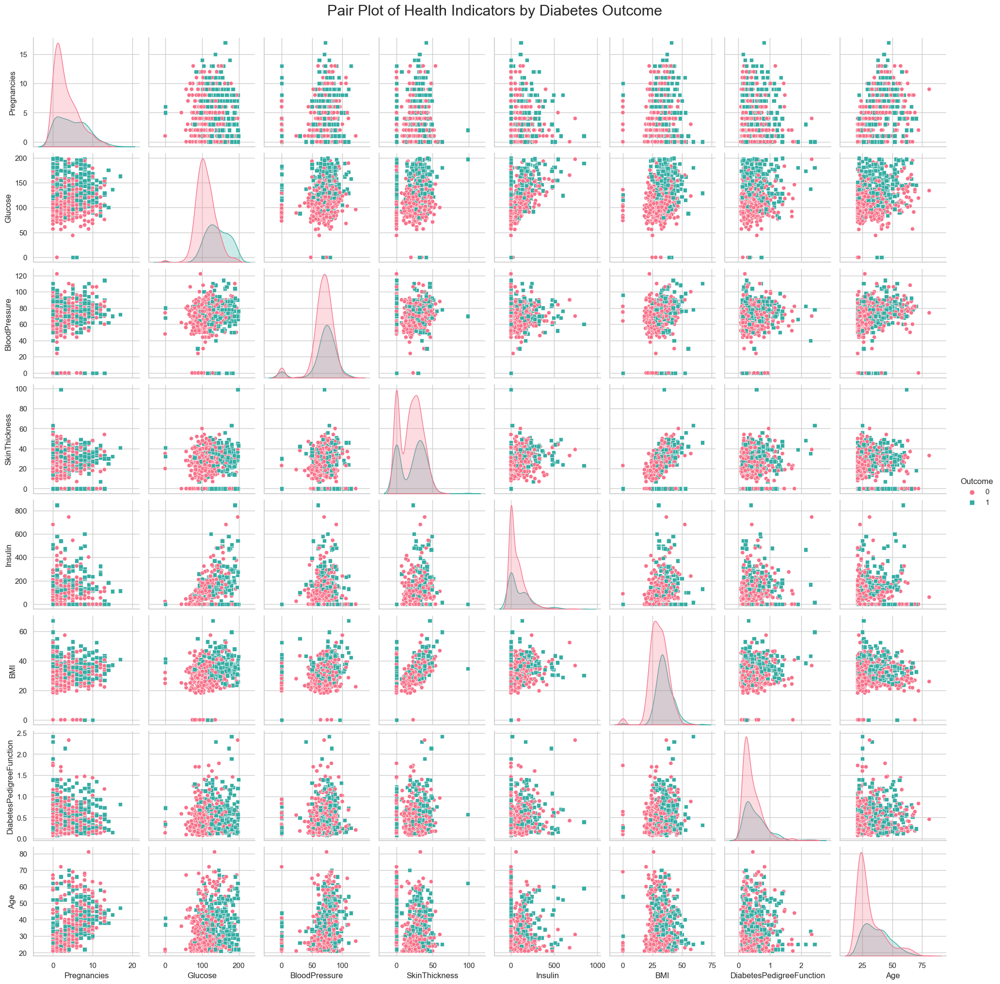

# Diabetes-Classfication-
**Diabetes Classification with Machine Learning**

This project involves building and evaluating several machine learning models to classify whether a patient has diabetes based on several health indicators. The models are trained and tested on the famous Pima Indians Diabetes Dataset. The dataset contains information about patients such as Glucose levels, BMI, Blood Pressure, etc., and the goal is to predict the likelihood of diabetes (Outcome).
Dataset
The dataset used is the Pima Indians Diabetes Dataset. It contains 768 samples with 8 features, and one target variable Outcome that indicates if the patient has diabetes (1) or not (0).

Pregnancies: Number of pregnancies
Glucose: Plasma glucose concentration
BloodPressure: Diastolic blood pressure (mm Hg)
SkinThickness: Triceps skinfold thickness (mm)
Insulin: 2-Hour serum insulin (mu U/ml)
BMI: Body mass index (weight in kg/(height in m)^2)
DiabetesPedigreeFunction: A function that scores likelihood of diabetes based on family history
Age: Age in years
Outcome: 0 (no diabetes), 1 (diabetes)
You can find this dataset in the UCI Machine Learning Repository or other open-source platforms. For this project, it is stored as diabetes.csv.

**Data Preprocessing**
Missing and Zero Values:
Some features such as Glucose, BloodPressure, SkinThickness, Insulin, and BMI have values of zero, which are not realistic. These values are replaced with the median or mean values of their respective columns based on their distribution.
Duplicate Rows: Any duplicate rows were removed from the dataset.
Feature Scaling: Features were normalized using the QuantileTransformer to ensure consistent scaling.

**Models Used**
The following machine learning models were implemented and evaluated:
Logistic Regression
Decision Tree
Random Forest
Support Vector Machine (SVM)
Neural Network (MLPClassifier)
Additionally, Random Forest was further tuned using GridSearchCV for hyperparameter optimization.

Evaluation
For each model, the following metrics were computed to assess performance:
Accuracy: The proportion of correctly predicted outcomes.
Precision: The proportion of true positive predictions out of all positive predictions.
Recall: The proportion of true positive predictions out of all actual positives.
F1 Score: The harmonic mean of precision and recall.
ROC-AUC Score: The area under the receiver operating characteristic curve, representing model performance at various threshold settings.
Hyperparameter Tuning
Hyperparameter tuning was performed for the Random Forest model using GridSearchCV. Parameters such as n_estimators, max_depth, and min_samples_split were optimized to improve the model's performance.

## Visualizations

The project includes several visualizations to aid in data understanding and model evaluation:

### 1. **Correlation Matrix**



This heatmap shows the correlation between different features in the dataset. Highly correlated features might be redundant and could be removed to improve model performance.

### 2. **Feature Importance**



This bar chart displays the importance of each feature in predicting diabetes, as determined by a Random Forest model.

### 3. **Distribution of Features**



Histograms are plotted to show the distribution of key features like glucose, BMI, and insulin levels. This helps to understand the spread and identify potential outliers.

### 4. **Error Bars**



Error bars visualize the variability of model performance across different folds during cross-validation.

### 5. **Pairplots**



Pairplots show the relationship between different features, color-coded by the diabetes outcome. This helps in understanding how features interact with each other and the target variable.

### 6. **Learning Curves**


Learning curves visualize how the model's training and validation performance evolve as more data is used. This helps in diagnosing whether the model is underfitting or overfitting.


## How to Run

### Clone the repository:
    ```bash
    git clone https://github.com/nikhil97353/diabetes-classification.git

How to Install 

    pip install -r requirements.txt

Run the script:

    python diabetes_classification.py


Conclusion
Support Vector Machine (SVM) achieved the highest accuracy of 76.62%, followed closely by Random Forest and Neural Network.
Random Forest (Tuned) showed a good balance between precision and recall after hyperparameter tuning.
The models have been evaluated using various metrics to provide a comprehensive understanding of their performance.
